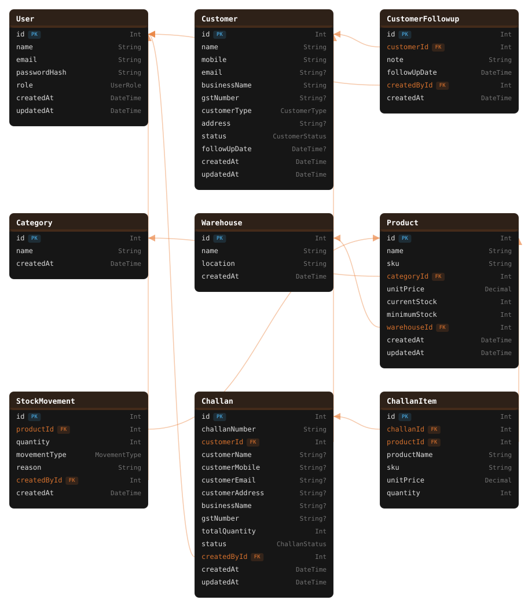

# ERP & CRM Management System

A full-stack ERP + CRM application for managing customers, products, inventory, stock movements, and sales challans for a wholesale/distribution business.

The application provides role-based access control and maintains transactional consistency between inventory and challan operations.

---

## 🚀 Live Demo

| | |
|---|---|
| **Frontend** | https://erp-crm223.netlify.app/ |
| **Documentation** | https://erp-crm223.netlify.app/documentation |

---

## 👤 Test Login Credentials

Use these to log in and explore each role directly.

| Role | Email | Password |
|---|---|---|
| Admin | `admin@example.com` | `Password123` |
| Sales | `sales@example.com` | `Password123` |
| Warehouse | `warehouse@example.com` | `Password123` |
| Accounts | `accounts@example.com` | `Password123` |

---

## 🗺️ Database Schema



The schema covers `User`, `Customer`, `CustomerFollowup`, `Category`, `Product`, `Warehouse`, `StockMovement`, `Challan`, and `ChallanItem`, with relationships managed through Prisma.

---

## 📌 Features

### Authentication & Authorization
- User login/logout
- JWT-based authentication
- HTTP-only authentication cookies
- Role-based authorization
- Supported roles: `ADMIN`, `SALES`, `WAREHOUSE`, `ACCOUNTS`

### Customer Management
- Create, view, update, and delete customers
- Customer type (Retail / Wholesale / Distributor) and status (Lead / Active / Inactive)
- Customer follow-ups with notes and follow-up dates
- GST / business information

### Product & Inventory Management
- Create, view, and update products
- Product categories, SKU management, unit pricing
- Minimum stock alert levels
- Warehouse association
- Real-time inventory tracking
- Stock IN / OUT operations with reason and "created by" tracking
- Full stock movement history
- Insufficient-stock protection (stock cannot go negative)

### Challan Management
- Create draft challans with multiple products
- Auto-generated challan numbers
- Update draft challans
- Confirm challans — validates stock availability before committing
- Product data is **snapshotted** on the challan (not just referenced by ID)
- Automatic inventory reduction and stock-movement creation on confirmation
- Challan history with pagination

---

## 🏗️ Architecture

```
                         USERS
                           │
                           ▼
                  ┌─────────────────┐
                  │     Netlify     │
                  │ React + Vite    │
                  └────────┬────────┘
                           │
                           │ HTTPS
                           ▼
                  ┌─────────────────┐
                  │     Render      │
                  │     Docker      │
                  │                 │
                  │ Node.js         │
                  │ Express.js      │
                  │ Prisma ORM      │
                  └────────┬────────┘
                           │
                           │ PostgreSQL
                           ▼
                  ┌─────────────────┐
                  │    Supabase     │
                  │   PostgreSQL    │
                  └─────────────────┘
```

**In short:** the React frontend (Netlify) talks to an Express/Node REST API (Render, containerized with Docker) over HTTPS. The API uses Prisma as the ORM layer against a Supabase-hosted PostgreSQL database. Auth is stateless JWT issued on login and stored in an HTTP-only cookie; role-based middleware gates access to each module. Inventory and challan-confirmation writes are wrapped in Prisma `$transaction` calls so stock updates and their audit trail (stock movements) are always committed together, never partially.

---

## Technology Stack

**Frontend:** React, Vite, React Router, Axios, CSS
**Backend:** Node.js, Express.js, Prisma ORM, JWT, bcrypt, CORS
**Database:** PostgreSQL (Supabase)
**Deployment:** Docker, Render, Netlify

---

## 📂 Project Structure

```
ERP_CRM/
│
├── backend/
│   ├── prisma/
│   │   ├── migrations/
│   │   ├── schema.prisma
│   │   └── seed.js
│   │
│   ├── src/
│   │   ├── config/
│   │   ├── middleware/
│   │   ├── routes/
│   │   └── server.js
│   │
│   ├── Dockerfile
│   ├── package.json
│   ├── .dockerignore
│   └── .gitignore
│
├── frontend/
│   ├── src/
│   │   ├── components/
│   │   ├── pages/
│   │   ├── api/
│   │   └── ...
│   │
│   ├── public/
│   ├── package.json
│   ├── vite.config.js
│   └── .gitignore
│
└── erp-crmSchema.svg
```

---

## 🔐 Authentication

```
User
 ↓
POST /login
 ↓
Validate credentials
 ↓
Generate JWT
 ↓
HTTP-only cookie
 ↓
Browser
```

Protected routes use authentication middleware to validate the cookie. Role-based middleware then checks whether the logged-in user has permission to perform the requested operation.

```
ADMIN
 ├── Customers
 ├── Products
 ├── Inventory
 └── Challans

SALES
 ├── Customers
 └── Challans

WAREHOUSE
 ├── Products
 └── Inventory

ACCOUNTS
 ├── Customers (read-only)
 └── Challans (read-only)
```

---

## 📦 Inventory Flow

**Stock IN**
```
Product → POST /inventory/:productId → movementType = IN
  → Increase currentStock → Create StockMovement
```

**Stock OUT**
```
Product → POST /inventory/:productId → movementType = OUT
  → Check available stock → Decrease currentStock → Create StockMovement
```

Both the product update and stock movement are performed inside a single Prisma transaction, so the inventory update and its history are always committed together.

---

## 🧾 Challan Flow

```
Create Challan
      ↓
   DRAFT
      ↓
Add Products
      ↓
Update Draft if required
      ↓
   Confirm
      ↓
Check Stock
      ↓
Transaction
      ├── Snapshot customer & product information
      ├── Decrease product stock
      ├── Create stock movements
      └── Change status → CONFIRMED
```

This guarantees a challan can never be confirmed when sufficient stock is unavailable, and stock is never left in a partially-updated state.

---

## 🗄️ Database

PostgreSQL is hosted on Supabase. Main entities: `User`, `Customer`, `CustomerFollowup`, `Category`, `Product`, `Warehouse`, `StockMovement`, `Challan`, `ChallanItem`. See the schema diagram above (`erp-crmSchema.svg`) for the full entity-relationship layout.

Schema changes are managed with Prisma migrations:

```bash
npx prisma migrate dev       # local development
npx prisma migrate deploy    # production
```

---

## ⚙️ Environment Variables

Environment variables are **not** committed to GitHub. The project uses `.env` locally and Render / Netlify environment-variable configuration in production.

**Backend**
```
DATABASE_URL=
DIRECT_URL=
PORT=
JWT_SECRET=
NODE_ENV=
FRONTEND_URL=
```

| Variable | Purpose |
|---|---|
| `DATABASE_URL` | PostgreSQL connection used by Prisma |
| `DIRECT_URL` | Direct PostgreSQL connection (for migrations) |
| `PORT` | Backend port; Render provides this in production |
| `JWT_SECRET` | Secret used for JWT signing/verification |
| `NODE_ENV` | `development` / `production` |
| `FRONTEND_URL` | Allowed frontend origin for CORS |

**Frontend**
```
VITE_API_URL=
```
Points the React app to the backend API, e.g. `VITE_API_URL=https://your-render-backend.onrender.com`

> ⚠️ Never commit `.env`, `.env.local`, database passwords, JWT secrets, or API keys. Production secrets live in Render / Netlify / Supabase configuration only.

---

## 💻 Local Setup

### Prerequisites
- Node.js 20+
- npm
- PostgreSQL
- Git
- Docker Desktop (optional but recommended)

### 1. Clone the repository
```bash
git clone YOUR_GITHUB_REPOSITORY_URL
cd ERP_CRM
```

### 2. Backend setup
```bash
cd backend
npm install
```

Create `backend/.env`:
```
DATABASE_URL="your-postgresql-url"
DIRECT_URL="your-direct-postgresql-url"
PORT=3000
JWT_SECRET="your-secret"
NODE_ENV=development
FRONTEND_URL="http://localhost:5173"
```

Generate the Prisma client:
```bash
npx prisma generate
```

Apply migrations:
```bash
npx prisma migrate deploy   # existing database
npx prisma migrate dev      # fresh local development
```

Seed the database (ensure `package.json` has `"prisma": { "seed": "node prisma/seed.js" }`):
```bash
npx prisma db seed
```

Start the backend:
```bash
npm run dev   # or: npm start
```
Backend runs at `http://localhost:3000`

### 3. Frontend setup
In a new terminal:
```bash
cd frontend
npm install
```

Create `frontend/.env`:
```
VITE_API_URL=http://localhost:3000
```

Start the frontend:
```bash
npm run dev
```
Frontend runs at `http://localhost:5173`

---

## 🐳 Docker Setup

The backend is containerized with Docker.

```bash
cd backend
docker build -t erp-crm-backend .
docker run --env-file .env -p 3000:3000 erp-crm-backend
```

```
Node.js → Express → Prisma → Supabase PostgreSQL
```

The frontend does not need a Docker container for the current deployment since it's deployed directly through Netlify.

---

## 🚀 Production Deployment

**Database — Supabase**
Production PostgreSQL is hosted on Supabase. Migrations are applied with `npx prisma migrate deploy`, which preserves existing data since it modifies the schema rather than recreating the database.

**Backend — Render**
Deployed as a Docker Web Service using `backend/Dockerfile`.
```
GitHub → Render → Docker Build → Express Container → Supabase
```
Key production env vars:
```
NODE_ENV=production
FRONTEND_URL=https://erp-crm223.netlify.app
```

**Frontend — Netlify**
- Build command: `npm run build`
- Publish directory: `dist`
- `VITE_API_URL=YOUR_RENDER_BACKEND_URL`
- Live: https://erp-crm223.netlify.app/

```
                    GitHub
                       │
             ┌─────────┴─────────┐
             ▼                   ▼
         Netlify               Render
        Frontend               Backend
        React/Vite          Docker/Express
             │                   │
             └─────── HTTPS ─────┘
                                 │
                                 ▼
                            Supabase
                           PostgreSQL
```

---

## 🧪 Testing

Tested locally and against the deployed environment using the browser, Axios, Docker, Prisma, and Postman/Thunder Client.

Flows verified:
- Login / authentication / protected routes for all four roles
- Customer creation, update, search, follow-up notes
- Product creation, update, search, low-stock filter
- Inventory IN / OUT with stock validation
- Challan creation, draft update, confirmation
- Inventory deduction and stock-movement creation after challan confirmation
- Negative-stock rejection

---

## 📮 Postman Collection

The exported Postman collection is included in the repository root:
```
erp_crm.postman_collection.json
```
Live collection (view online): https://rittulraj-724273.postman.co/workspace/Rittul-Raj's-Workspace~1e407ea9-94d0-4878-87b6-ede6d2767781/collection/57227147-94cd954b-b7d2-4d51-b00f-0ea136fb26a7?action=share&creator=57227147&live=mlu7z0ou47

To use it: open Postman → Import → select `erp_crm.postman_collection.json` from the repo. All requests are pre-configured with the routes below; just set your own `baseUrl` variable to whichever environment you're testing against.

Covers:
```
Authentication
├── Login
└── Logout

Customers
├── Create / Get All / Get By ID / Update / Delete

Products
├── Create / Get All / Get By ID / Update

Inventory
├── Stock IN
└── Stock OUT

Challans
├── Create / Get All / Get By ID / Update Draft / Confirm
```

---

## 🎥 Screen Recording

Recording covers the full flow below:

```
Login → Dashboard → Customers → Products
   → Inventory (IN / OUT) → Create Challan
   → Confirm Challan → Show inventory decreased → Show stock movement
```

---

## 📝 Assumptions

- PostgreSQL is the primary relational database; Supabase is the production provider.
- Product stock is maintained at the product level; a product belongs to a warehouse.
- A challan starts in `DRAFT` state; only draft challans can be modified.
- Confirming a challan reduces product inventory and creates corresponding OUT stock movements atomically.
- Stock cannot be reduced below zero.
- Product SKUs and customer email addresses are unique.
- Authentication uses JWT stored in an HTTP-only cookie.
- CORS allows requests only from the configured frontend origin.
- Environment secrets are managed outside the Git repository.

---

## 📌 Known Limitations / Incomplete Parts

- AWS deployment was not used (Render/Netlify/Supabase used instead — per assignment, AWS is a bonus, not required).
- No PDF export for challans/invoices yet.
- No product image upload (S3) yet.
- No automated test suite or CI/CD pipeline yet.
- Category and Warehouse selection on the Product form currently take a raw numeric ID rather than a dropdown — functional, but not the most user-friendly.
- Dashboard summary counts (`customers.length`, `products.length`) reflect the current page of results, not the full table total, until pagination totals are wired in.

---

## 📌 Future Improvements

- Redis-based caching and rate limiting
- Advanced dashboard analytics
- PDF challan/invoice generation
- Email notifications
- Audit logs
- Automated testing
- CI/CD pipeline
- Kubernetes deployment
- Monitoring and logging

---

## 👨‍💻 Project Summary

A full-stack business management application demonstrating REST API design, JWT authentication and role-based access control, PostgreSQL schema design with Prisma, database migrations and transactions, inventory consistency guarantees, Docker containerization, and cloud deployment with production CORS/cookie configuration.

**Deployment:** Frontend on Netlify · Backend on Render (Docker) · Database on Supabase PostgreSQL
**Live Demo:** https://erp-crm223.netlify.app/

---

<p align="center">
Made with full dedication (and an alarming amount of coffee ☕) by <b>Rittul Raj</b> 🚀
</p>